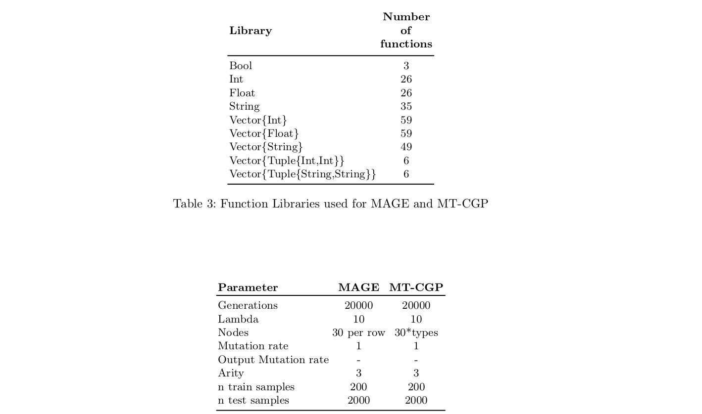
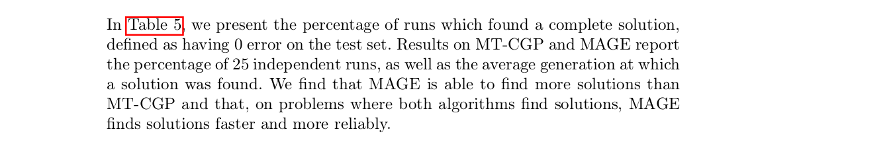
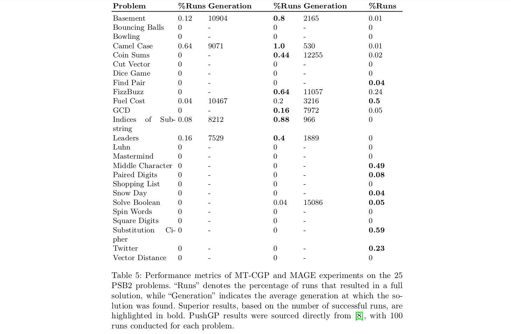
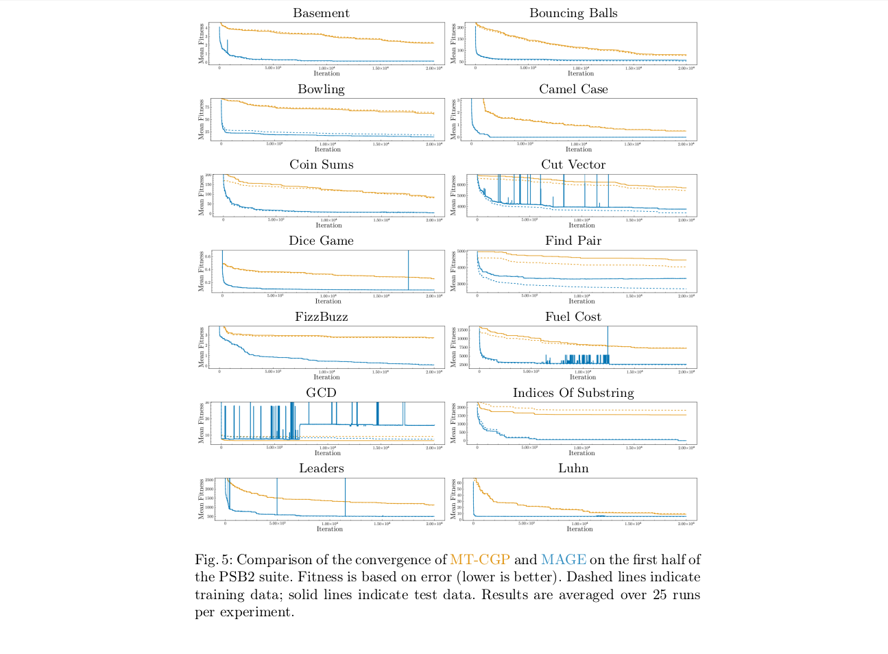
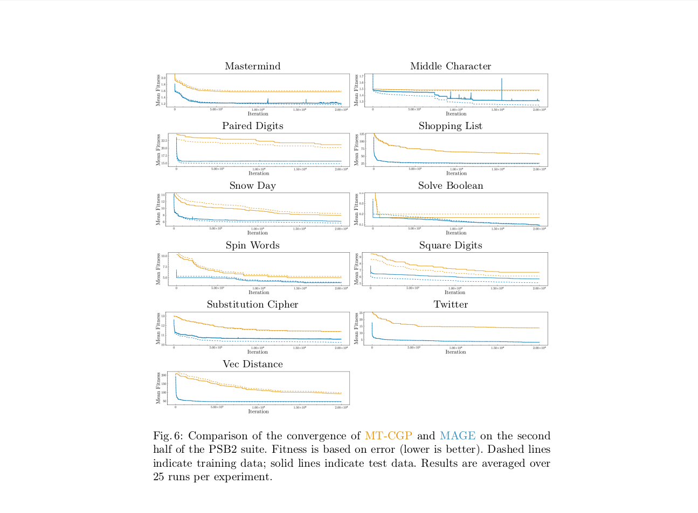

# MULTIMODAL ADAPTIVE GRAPH EVOLUTION (MAGE) for Program Synthesis

This repository contains the necessary code to test [MAGE.jl](https://github.com/camilodlt/MAGE.jl) against all 25 [PSB2](https://github.com/thelmuth/psb2-python) problems. 

The package [SearchNetworks.jl](https://github.com/camilodlt/SearchNetworks.jl) is a dependency of MAGE.

The experiments published in the paper were run with the MAGE.jl package at this [commit](https://github.com/camilodlt/MAGE.jl/commit/a2373d1cbcd3dbad70bd37ec91acca00719391aa) in the history.

I will make updates to this repo showing the results.

## Appendix

### Experimental parameters



### Solved problems




### Convergence Results




## Publication

```
@inproceedings{10.1007/978-3-031-70055-2_19,
author = {De La Torre, Camilo and Lavinas, Yuri and Cortacero, Kevin and Luga, Herv\'{e} and Wilson, Dennis G. and Cussat-Blanc, Sylvain},
title = {Multimodal Adaptive Graph Evolution for Program Synthesis},
year = {2024},
isbn = {978-3-031-70054-5},
publisher = {Springer-Verlag},
address = {Berlin, Heidelberg},
url = {https://doi.org/10.1007/978-3-031-70055-2_19},
doi = {10.1007/978-3-031-70055-2_19},
abstract = {Program synthesis constitutes a category of problems where the objective is to automatically produce computer programs that meet specified criteria. Among Genetic Programming algorithms, Cartesian Genetic Programming has been successfully used for a variety of function synthesis problems, such as circuit design, pattern analysis, and game playing. These problems are designed to work only on a single data type, for example, boolean values or entire images. Cartesian Genetic Programming cannot directly be applied to problems with multiple data types, which poses a great limitation, as more realistic programs should be able to deal with different data types. Mixed-Type Cartesian Genetic Programming is the only current extension of Cartesian Genetic Programming which allows for processing different data types. In this work, we present and study Multimodal Adaptive Graph Evolution, a multi-chromosome generalization of Cartesian Genetic Programming that groups functions by return type and constrains graph mutation based on node’s type coherence. We compare Multimodal Adaptive Graph Evolution to Mixed-Type Cartesian Genetic Programming on the Program Synthesis Benchmark Suite, showing that the representation and mutation constraints of Multimodal Adaptive Graph Evolution aid in the search of multimodal functions. Using Search Trajectory Networks, we find that Multimodal Adaptive Graph Evolution converges faster to a local or global minimum compared to Mixed-Type Cartesian Genetic Programming and explores the solution space more effectively by creating candidate solutions with lower semantic redundancy.},
booktitle = {Parallel Problem Solving from Nature – PPSN XVIII: 18th International Conference, PPSN 2024, Hagenberg, Austria, September 14–18, 2024, Proceedings, Part I},
pages = {306–321},
numpages = {16},
keywords = {Genetic programming, Program synthesis, Evolutionary computation, Search Trajectory Networks},
location = {Hagenberg, Austria}
}
```
